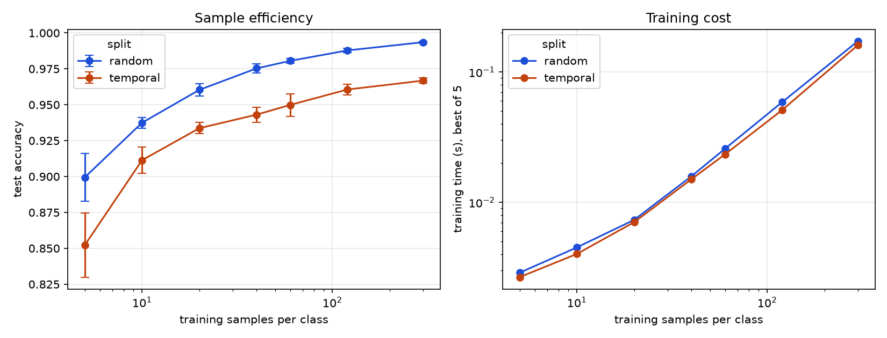
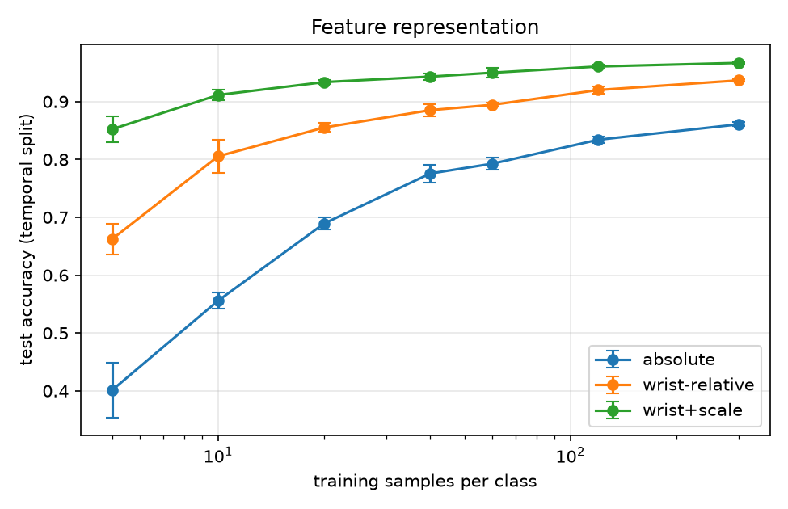
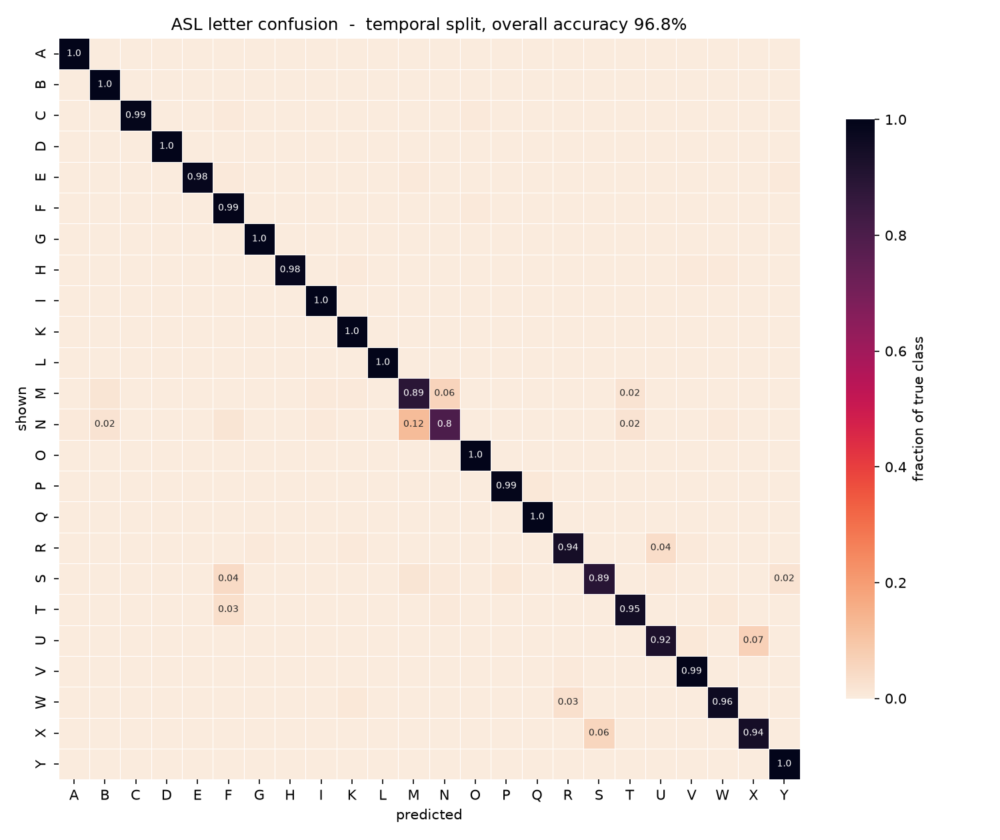

# signspeak

**Real-time ASL fingerspelling recognition, plus gestures you define yourself in
20 samples and under a millisecond.** Runs on a laptop CPU and in the browser.
Video never leaves the device — only 126-dimensional landmark arrays are ever
stored.

Two builds, one pipeline: a Python desktop application and a browser version
that runs the byte-identical MediaPipe graph and an exported ONNX model,
verified to agree with the Python implementation to within float32 rounding.

---

## What it does

- **24 ASL letters** (A–I, K–Y; J and Z need motion) recognised from a webcam
- **Custom gestures** — invent a shape, name it, map it to a phrase. One or two
  hands. Training takes **0.3 ms**
- **A four-stage temporal merger** that turns ~30 disagreeing predictions per
  second into stable, committed text
- **Speech output**, gesture **export/import**, and everything running
  **client-side** in the browser build

---

## Results

All figures reproduce from `python/experiments/`. Outputs land in
`docs/results/`.

### Sample efficiency — the central claim

Five examples per letter gets 85% across 24 classes. Sixty gets 95%. Six times
the data buys ten points, and the curve is flat past that.



| samples / class | accuracy | training time |
|---:|---:|---:|
| 5 | 85.2% ± 2.2 | 0.003 s |
| 10 | 91.1% ± 0.9 | 0.004 s |
| 20 | 93.4% ± 0.4 | 0.007 s |
| 60 | 95.0% ± 0.8 | 0.023 s |
| 300 | 96.7% ± 0.2 | 0.161 s |

*24 classes, 5 seeds, temporal split. Training time is the minimum across
seeds — mean and median both produced curves where training got cheaper with
more data, because CPU contention only ever adds time.*

### Two splits, and the gap is a result

The training data is one signer's continuous session, so neighbouring frames are
near-identical. A **random** split puts near-duplicates on both sides and the
model scores well by recognising the session rather than the handshape — it
reports 99.8% on the full dataset, which is meaningless. A **temporal** split
(train on earlier frames, test on later) keeps them genuinely apart.

Random reads 3–4 points higher at every N. That gap *is* the leakage, measured.

### Feature representation

The build spec called for raw normalised coordinates. Measurement disagreed:

| representation | N=5 | N=300 |
|---|---:|---:|
| absolute (as specified) | 40.1% | 86.1% |
| wrist-relative | 66.2% | 93.7% |
| **wrist-relative + scale-normalised** | **85.2%** | **96.7%** |



Absolute coordinates with 300 samples per class still lose to the current
representation with 10. Position and apparent size of the hand were most of what
the "absolute" model was learning.

### Confusion



| shown | predicted | rate |
|---|---|---:|
| N | M | 12.2% |
| U | X | 6.7% |
| M | N | 6.1% |
| X | S | 5.6% |
| S | F | 4.4% |
| R | U | 3.9% |

Weakest recall: N 80.0%, M 88.9%, S 89.4%. Eleven letters sit at 99–100%.

The failures are the ones a person would make. M and N differ by a single finger
over the thumb; R (crossed index and middle) against U (the same fingers
parallel) is the textbook ASL ambiguity. A model failing exactly where humans
find it ambiguous is evidence it learned handshape rather than a dataset
artefact.

M and N are separately hard **twice**: they also had the worst landmark
*detection* rates during import, at 40% and 42%, because a tucked thumb often
stops MediaPipe seeing a hand at all. Detection failure and classification
failure are different problems that happen to land on the same letters.

### Honest limitations

- **Training data is a single signer.** Every number above is within-signer.
  Cross-subject evaluation and personal calibration are implemented in the plan
  but not yet measured — see [Roadmap](#roadmap).
- **Absolute accuracy is not the headline.** The sample-efficiency curve and the
  representation ablation are, because they hold regardless of dataset size.

---

## How it works

```
webcam frame
   │  mirrored once, at capture
   ▼
MediaPipe HandLandmarker ──> 21 landmarks × (x, y, z) × 2 hands
   ▼
126-D vector           (absent hand = 63 zeros, slot chosen by handedness)
   ▼
rolling 30-frame buffer ──> per-coordinate median
   ▼
wrist-relative + scale-normalised ──> StandardScaler
   ▼
RBF SVM (letters)   or   KNN, k=3 (your gestures)
   ▼
four-stage merger ──> committed letters ──> word ──> sentence
```

The merger is what makes the output usable:

| stage | what it does |
|---|---|
| 1 · confidence filtering | drop predictions below τ = 0.35 |
| 2 · buffer accumulation | count consecutive frames agreeing on a label |
| 3 · hold-time validation | commit only when frames ≥ 12 **and** elapsed ≥ 0.4 s **and** mean confidence ≥ τ |
| 4 · duplicate suppression | never commit the same label twice running |

Time is injected rather than read from the clock, so recorded sequences replay
deterministically and each stage can be ablated independently.

---

## Quick start

### Desktop (Python)

```bash
cd python
python -m venv .venv
.venv/Scripts/python.exe -m pip install -r requirements.txt
.venv/Scripts/python.exe -m src.download_models

.venv/Scripts/python.exe -m src.live            # letters + custom gestures
.venv/Scripts/python.exe -m src.live --raw      # merger off, to see what it fixes
```

Press `h` in the window for the key list.

### Browser

```bash
cd web
npm install            # postinstall copies the wasm runtimes into public/
npm run dev
```

Open the printed URL. `localhost` counts as a secure origin, so the camera
works without HTTPS.

### Record a custom gesture

```bash
# desktop
.venv/Scripts/python.exe -m src.record_gesture --name thumbs_up --phrase "OK!"
.venv/Scripts/python.exe -m src.record_gesture --list
```

In the browser, use **Record new** in the Custom panel. Gesture files are plain
JSON with the same schema on both sides, so a vocabulary exported from the
desktop imports into the browser unchanged.

### Reproduce the results

```bash
cd python
.venv/Scripts/python.exe -m experiments.sample_efficiency --representations
.venv/Scripts/python.exe -m experiments.confusion_matrix
```

### Tests

```bash
cd python && .venv/Scripts/python.exe tests/test_merger.py
cd web && npm test        # core logic + Python/JavaScript parity
```

---

## Three things that are easy to get wrong

**Chirality.** A left hand and a right hand signing the same letter are mirror
images, and neither wrist-relative nor scale normalisation removes that. Public
datasets are usually raw camera shots while a live selfie feed is mirrored, so
importing without `--mirror` trains on the mirror image of every handshape the
user will actually sign. It validates near-perfectly and fails completely live.
Measured here with a pose-independent palm-normal sign: +0.071 for the mirrored
webcam, −0.050 for the dataset as-is, +0.052 mirrored.

**Representation lives at training time, not recording time.** `data/` always
holds raw absolute coordinates, so changing representation costs a retrain and
never a re-record, and every setting stays comparable on the identical dataset.
The model records which representation it was trained under and refuses to load
against a mismatched config — that failure is otherwise invisible, because the
model loads, predicts, and is quietly wrong.

**Never median across a changing hand count.** The rolling buffer takes a
per-coordinate median over 30 frames. Raise a second hand and the window is
still full of one-handed history; once past half, that hand's 63 coordinates
median to zero and a two-handed gesture silently becomes a one-handed one —
distance from its own centre jumped from 0.000 to 2.745 against a 0.35
threshold. The window now restarts whenever the hand count changes.

---

## Layout

```
python/
  src/          config, landmarks, recording, features, training,
                prediction, merger, custom gestures, speech, UI
  experiments/  sample efficiency, confusion matrix
  export/       ONNX export with verification against sklearn
  tests/
web/
  src/          the same pipeline in JavaScript
  tests/        core logic, plus Python↔JavaScript parity
docs/results/   figures and tables
```

`CODE_NOTES.md` explains every module and the reasoning behind it.

---

## Roadmap

| | status |
|---|---|
| Landmark extraction, recording, training, prediction, merger | done |
| Desktop UI, speech, export/import, custom gestures | done |
| Sample efficiency, confusion matrix | done |
| Browser build with verified Python parity | done |
| Cross-subject evaluation, personal calibration | needs multi-signer recordings |
| Merger ablation (character error rate per stage) | pending |
| Accounts and sync, mobile polish, user testing | planned |

---

## Built with

MediaPipe Tasks · scikit-learn · ONNX Runtime Web · OpenCV (camera and drawing
only — no recognition) · NumPy · Vite

The browser loads the byte-identical `hand_landmarker.task` graph, so both sides
run the same feature pipeline. Parity is asserted in CI-able tests: the feature
transform agrees to 1.19e-7 over 7,560 values, and the exported model matches
scikit-learn on 60 of 60 real samples.
